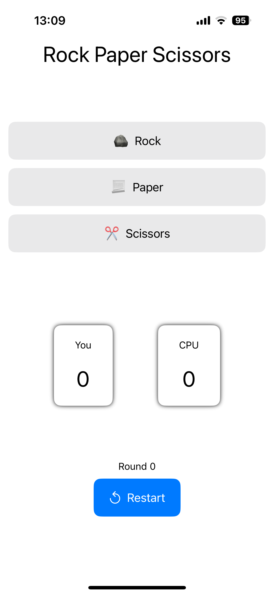
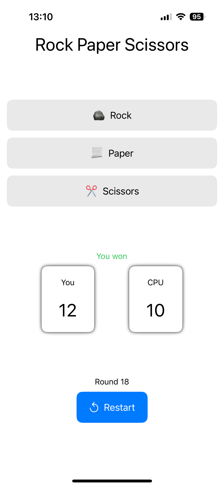
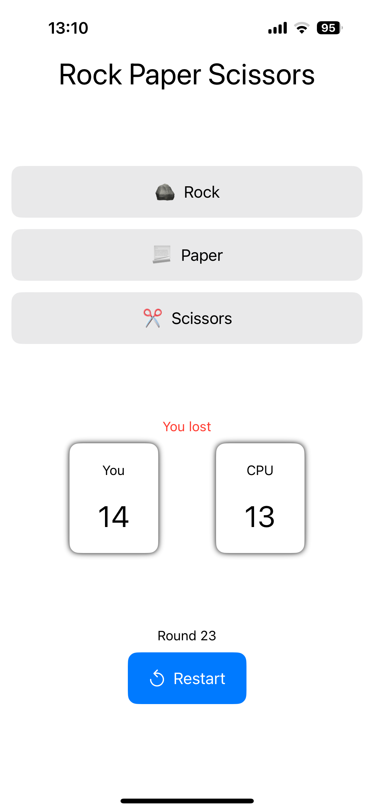
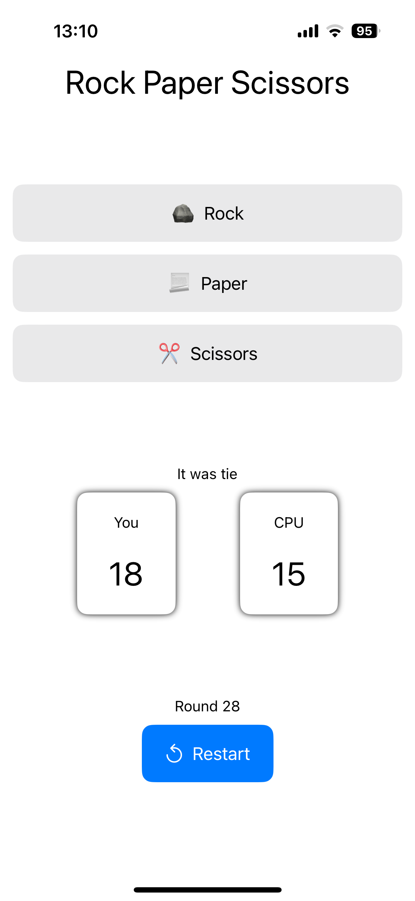

#  Rock Paper Scissors

This is a simple iOS game built using Swift.
It's my first project written in Swift, aimed at providing a basic introduction to iOS app development.

## Screenshots

    
    

 

    
    

